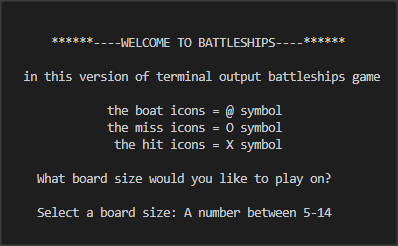
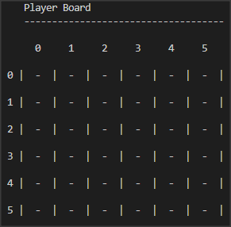
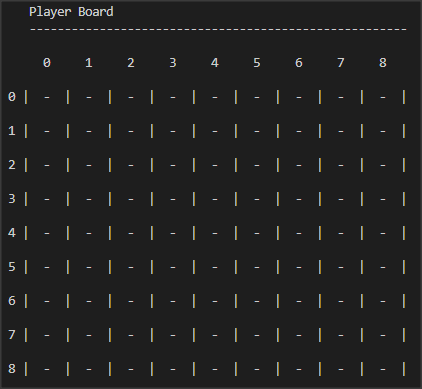
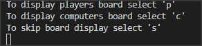
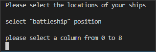
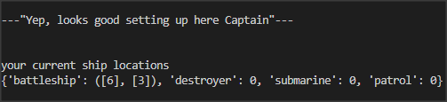
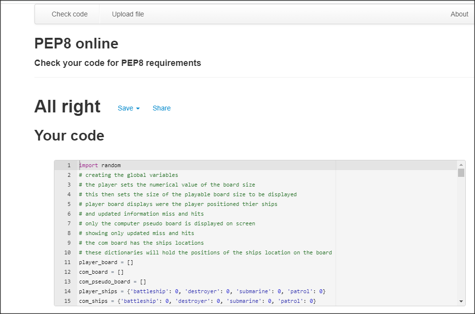

-----
# BATTLESHIPS

this is a Python generated game which is played through the terminal and is deployed using a Heroku mock terminal.

For those who never played BATTLESHIPS before, The object of the game is to take turns at 
guessing were your opponets ships are positioned on a numbered grid.

there are four ships, each player has the battleship, destroyer, submarine and patrol boat
each ship represents a life and one position on the grid, making four lives in total for each player.

who ever can destroy all of thier opponets ships wins the game.

Here is the live version of my project
image

## How to play
The terminal displays a welcoming intro with a quick guide to how each game element
is visually represented on the terminal stating that 

       a ship = @ symbol       a miss = O symbol         a hit = X symbol

* Requests the users input to set the grid size in a particular range    5-14 in length
if the selection is under or over this range then they are informed of the error and asked to
enter another value. 

* Once the board size is set the option of displaying either the player or computers board
is availiable with a third option to skip and continue to the next section of the game.

* The player is asked to input each of their ships location on to the custom sized grid
while the computers is randomly generated.

* The game starts with the opponents taking turns at guessing each others ship locations 

* Eventually when either of the combatants ships/lives are lost the game is over with
the player declared the winner or loser.

## Features

### Current Features

* **Customized board generation**

  users input sets the grid size in a particular range 5-14 in length

  

  board changes to size as long as its in the range offered
  otherwise exception handaling repeats input offer until satisfied 

image

* **Board display options**

  there are three options offered to the player to either display either
  the player or computers board or skip onto the next section of the game.
  image

* **Picking ship locations**

  column and row inputs are requested from the player to set the location 
  of each ship to be placed on the players board while the computers selection
  is asigned but hidden from sight.

  validation of current and other ships position in the player object is checked
  as not to make the mistake of placing two or more ships in the same square.

  co-ordinates must be inside of the board and be integrs to continue

  

  Data of ships positions is contained in the player_ships object
  and com_ships object

## Future features
   ships of varying sizes can occupy more than one square position on the grid

## Data Model
*  Lists and Dictionaries

    Lists store the populated grid icon strings based
    on board size input and updated as the game carries on

    Dictionares store the cloumn and row values of each ship location

## Bugs

 * solved bugs

## Remaining bugs
 * no remaining bugs

## Validator Testing
* PEP8
 some Errors found but are all fixed

 

## Deployment

This project was deployed using Code Institute mock terminal on Heroku

### Steps for deployment
* 
* 
* 
* 
# Credits
Code Institute for deployment terminal

